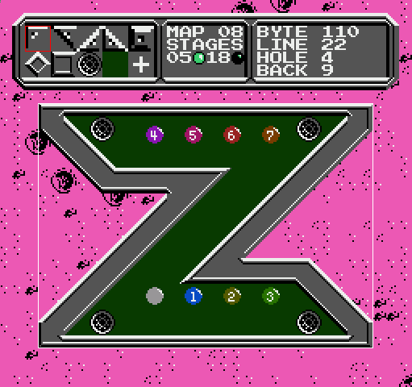

# Description
A GPLv3 licensed level editor for the Famicom game Lunar Ball written in C/SDL.

# How to compile

## Linux

Install the SDL2 development package of your distro (For example in Debian based distros `libsdl2-dev`). Then just type `make` at the repository root directory. The executable will be at `bin/moon`. You can also compile for debugging using `make debug`, it will remove optimizations and add debugging symbols for tools like `gdb`.

## For Windows from Linux

Install mingw-w64 targeting i686 compiler. Download [SDL2 development libraries for mingw](https://www.libsdl.org/download-2.0.php) and extract at the repository root directory. Name the extracted directory `SDL2` or modify the `SDL2_MINGW_DIR` variable at the `Makefile`. Then just type `make windows`. The executable will be at `bin/moon.exe`.

## For Windows From Windows

I still haven't tried doing this, but it should work using mingw-w64 and probably cygwin, in which case the instructions are the same as in Windows from Linux. If you know what you are doing you can use whatever you want since the compiling and linking process is fairly trivial.

## Notes

Remember to type `make clean` if you compiled for either platform and want to compile for the other one.

# How to use

Drag the rom file to the executable, or pass it as a parameter. When you close the editor, it should save your changes in a new rom `output.nes`, you can also reopen this file if you want.

For now, it only works with the japanese version of the game.

## Controls

+ Left Click - Basic interaction. Use tool to add something, drag until you are satisfied with your action.
+ Right Click - Delete something from selected tool, you can also drag to see what's going to be deleted.
+ Middle Click / U key - Undo last action, can also be used to cancel current action.
+ Left/Right Arrow - Change map.
+ Up Arrow - Switch stage, there is two per map.
+ Down Arrow - Change toolbox.
+ Delete key - Clear entire map, this can't be undone!
+ Keys 0 to 9 - Select tool from toolbox.

# Screenshots

